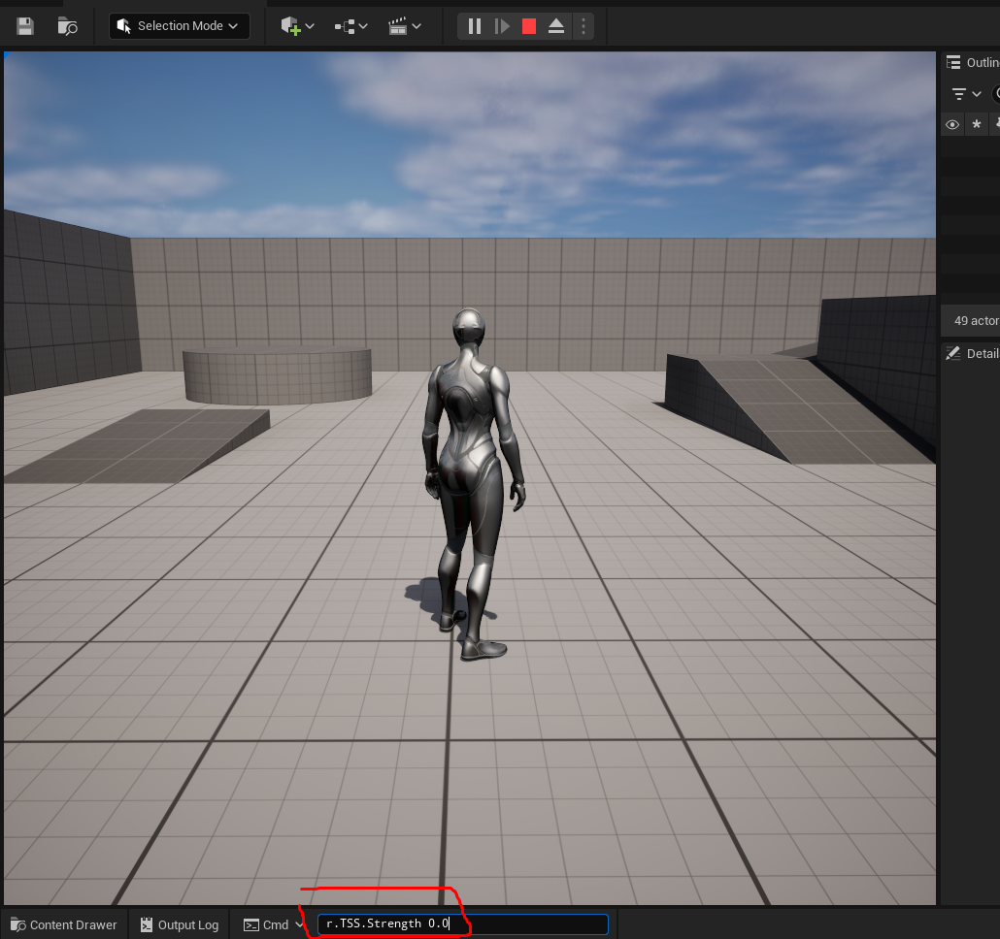
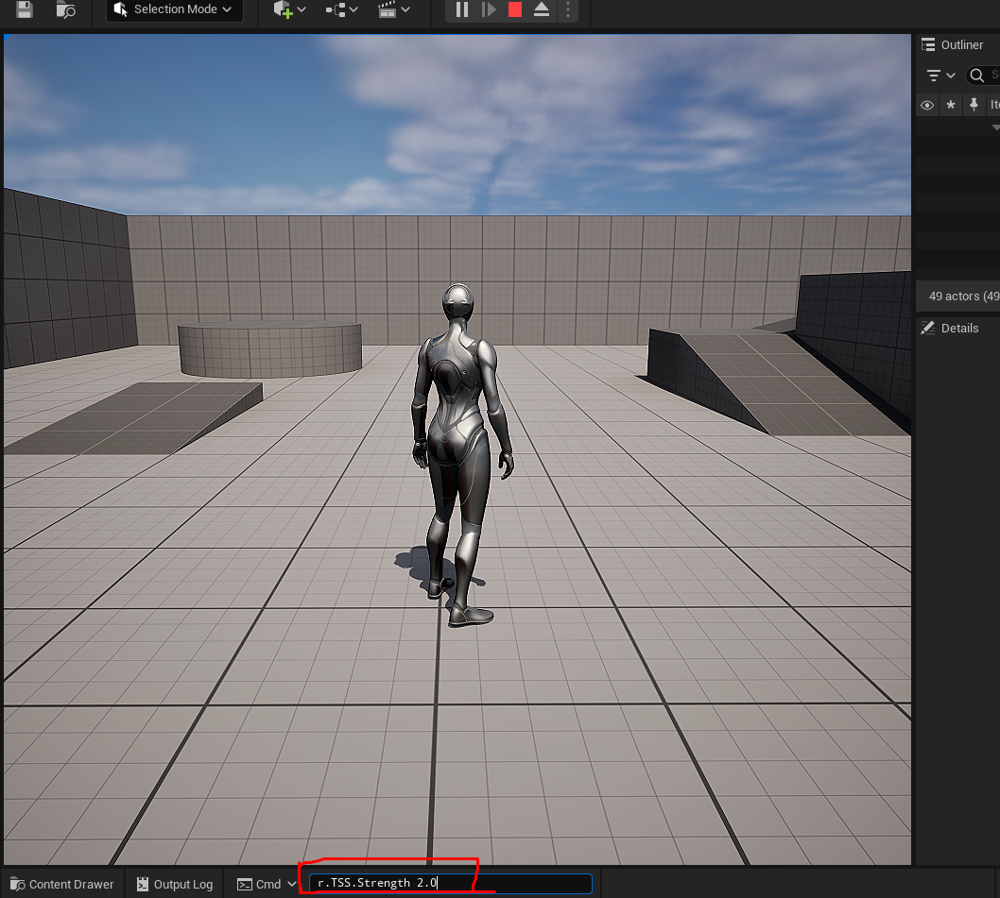

# TSS — GPU Sharpening Plugin

Плагин для Unreal Engine 5.3. Глобальный compute-шейдер шарпинга через FSceneViewExtension, без патча движка.

### TSS выключен (`r.TSS.Enabled 0`)


### TSS включен (`r.TSS.Enabled 1`, `r.TSS.Strength 2.0`)


## Установка

1. Скопируйте папку `TSS` в `Plugins/` вашего проекта:

```
B_PlusIntegrationKit/
├── Content/
├── Source/
├── Plugins/
│   └── TSS/          ← сюда
│       ├── TSS.uplugin
│       ├── Shaders/
│       └── Source/
└── .uproject
```

2. Перезапустите редактор. В логе должно быть:
```
LogTSS: Warning: TSS: OnPostEngineInit
LogTSS: Warning: TSS: ViewExtension created=1
LogTSS: Warning: TSS: subscribing to Tonemap
```

3. В консоли включите шарпинг:
```
r.TSS.Enabled 1
```

## Команды консоли

| Команда | По умолчанию | Описание |
|---------|-------------|----------|
| `r.TSS.Enabled 1` | `0` | Включить шарпинг |
| `r.TSS.Enabled 0` | — | Выключить шарпинг (passthrough) |
| `r.TSS.Strength <float>` | `1.0` | Сила шарпинга, диапазон 0.0–2.0 |

## Примеры

```
# Включить шарпинг со стандартной силой
r.TSS.Enabled 1

# Слабый шарпинг (30%)
r.TSS.Strength 0.3
r.TSS.Enabled 1

# Средний шарпинг (50%)
r.TSS.Strength 0.5
r.TSS.Enabled 1

# Максимальный шарпинг
r.TSS.Strength 2.0
r.TSS.Enabled 1

# Выключить
r.TSS.Enabled 0
```

## Структура плагина

```
TSS/
├── TSS.uplugin
├── Shaders/TSSSharpen.usf        # HLSL compute shader
├── Source/TSS/
│   ├── TSS.h                     # FTSSSharpenShader (GLOBAL_SHADER)
│   ├── TSS.cpp                   # Модуль, AddSharpenPass
│   ├── TSSBuild.cs               # Модули
│   ├── TSSViewExtension.h        # FSceneViewExtensionBase
│   └── TSSViewExtension.cpp      # SubscribeToPostProcessingPass → Tonemap
└── README.md
```
